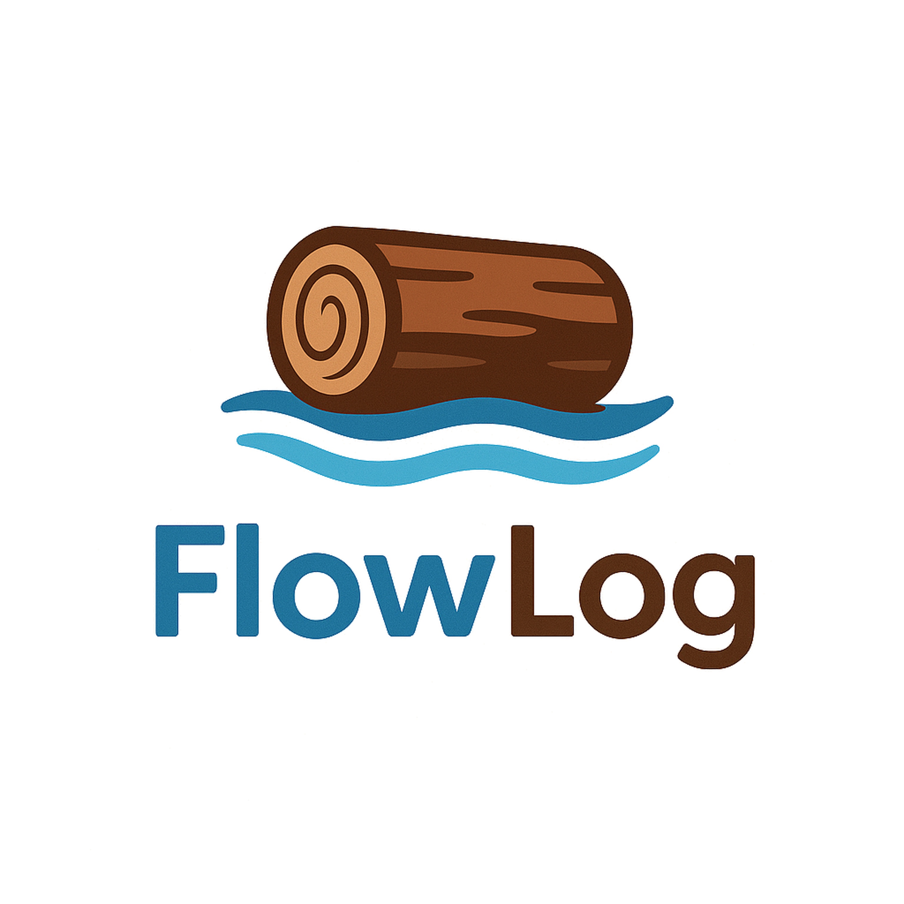

# FlowLog

<p align="center">  </p>

FlowLog is an efficient, scalable and extensible Datalog engine built atop Differential Dataflow.


## Installation

### Prerequisites
- Rust and Cargo (latest stable version recommended)
- Differential Dataflow (0.14.2)

### Building
```bash
# Release build
cargo build --release
```

## Command Line

- `./src`  
  - `./src/parsing` - the parsing crate
     
     ```bash
     cargo build # build the parsing crate
     ```
     
     run the binary (i.e., `./src/parsing/src/main.rs`) of built parsing crate
     ```bash
     cargo run -p parsing
     ```
  - `./src/executing` - end to end execution
      ```bash
      cargo build --release
      # Run on 64 threads for batik.dl program
      ./target/release/executing -p ./examples/programs/batik.dl -f ./examples/csvs -c ./examples/csvs -d $'\t' -w 64 
      ```

## Usage

### Command Options

<table>
<tr>
  <th align="center">Option</th>
  <th align="center">Description</th>
</tr>
<tr>
  <td align="center"><code>-p, --program &lt;FILE&gt;</code></td>
  <td>Path to the Datalog program file (<code>.dl</code> extension)</td>
</tr>
<tr>
  <td align="center"><code>-f, --facts &lt;DIR&gt;</code></td>
  <td>Path containing input facts</td>
</tr>
<tr>
  <td align="center"><code>-c, --csvs &lt;DIR&gt;</code></td>
  <td>Path for output results</td>
</tr>
<tr>
  <td align="center"><code>-d, --delimiter &lt;CHAR&gt;</code></td>
  <td>Delimiter for input files (default: <code>,</code>)</td>
</tr>
<tr>
  <td align="center"><code>-w, --workers &lt;NUM&gt;</code></td>
  <td>Number of threads (default: single core)</td>
</tr>
<tr>
  <td align="center"><code>-v, --verbose</code></td>
  <td>Enable verbose logging</td>
</tr>
<!-- <tr>
  <td align="center"><code>-h, --help</code></td>
  <td>Print help information</td>
</tr> -->
</table>

#### Example Commands

```bash
# Run a program with default settings
./target/release/executing -p ./examples/programs/reach.dl -f ./examples/facts

# Run on 16 threads and tab as delimiter
./target/release/executing -p ./examples/programs/tc.dl -f ./examples/csvs -d $'\t' -w 16

# Run on verbose output and custom output directory
./target/release/executing -p ./examples/programs/batik.dl -f ./examples/csvs -c ./results -v
```

### Datalog Syntax

FlowLog supports standard Datalog with common extensions:

```datalog
// Simple graph reach
reach(x) :- source(x).
reach(y) :- reach(x), edge(x, y).

// constraints
two_hops(x, z) :- edge(x, y), edge(y, z), x != z.

// negation
indirect_only(x, z) :- edge(x, y), edge(y, z), !edge(x, z).

// aggregation
count_paths(x, z, COUNT(y)) :- edge(x, y), edge(y, z).
```


## Examples

The `examples/` directory contains several sample Datalog programs:

- `examples/programs/batik.dl`: DOOP program for batik
- `examples/programs/`: Other sample programs tested

## Contributing

Contributions are welcome! Feel free to submit a PR.


