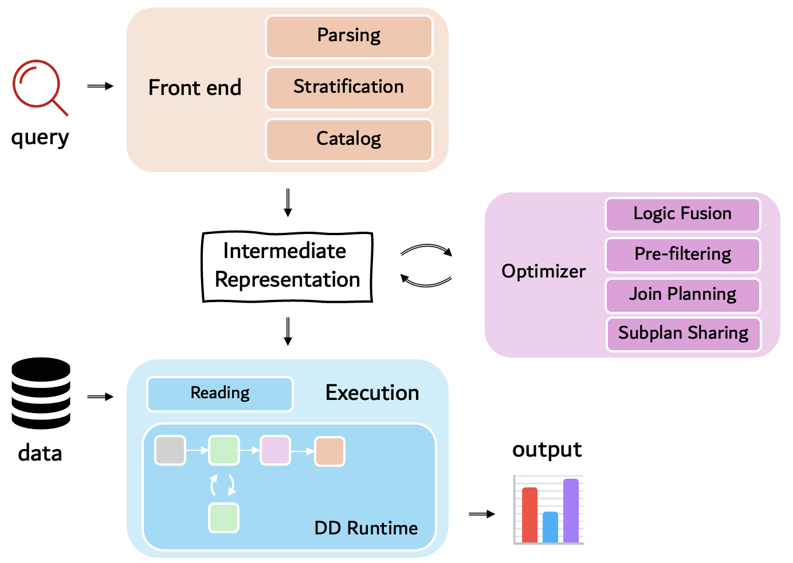

<p align="center">
  
</p>

<!-- <h1 align="center">FlowLog</h1> -->

<p align="center">
  <strong>An efficient, scalable, and extensible Datalog engine built atop Differential Dataflow</strong>
</p>

<p align="center">
  <a href="https://arxiv.org/pdf/2511.00865">Paper</a> •
  <a href="#quick-example">Quick Start</a> •
  <a href="#datasets">Datasets</a> •
  <a href="#reproducing-paper-figures">Reproduce Results</a>
</p>

---

## FlowLog Paper

This repo contains the implementation for the paper:

**FlowLog: Efficient and Extensible Datalog via Incrementality**  
Hangdong Zhao, Zhenghong Yu, Srinag Rao, Simon Frisk, Zhiwei Fan, Paraschos Koutris  
VLDB 2026 (Boston)

[**Read the paper on arXiv**](https://arxiv.org/pdf/2511.00865)

---

## FlowLog Architecture

FlowLog uses a modular architecture that collectively creates a Datalog execution pipeline as follows (also see Figure 1 of the paper):

<!-- <p align="center">
  
</p> -->

```
├── parsing       # Parsing Datalog program
├── strata        # Stratification
├── planning      # Generate logical IR and optimize (per rule)
  ├── catalog       # Generate metadata 
  └── optimizing    # Query optimization 
└── executing     # Executor
  ├── reading       # Reading data from CSV
  └── macros        # Rust macros for code generate each differential operator
```

---

## Quick Example

### Environment Setup
```bash
# Automated setup (recommended):
# The env.sh script automatically handles all requirements including:
# - Rust = 1.89.0 (pinned version for reproducibility)
# - differential-dataflow = 0.16.2 (paper version for reproducibility)
# - timely = 0.23.0 (paper version for reproducibility)
# - ...

# Simply run:
bash tool/env.sh

# After installation, you may need to start a new terminal session
# or run `source ~/.bashrc` (or `source ~/.zshrc` if using zsh)
# so that environment variables and PATH updates take effect.

# Manual verification (optional):
# To check your Rust version after setup
rustc --version  # Should show: rustc 1.89.0
```

> **Note on Versions**: For paper reproducibility, we use differential-dataflow 0.16.2 and timely 0.23.0 as reported in the VLDB paper. However, we are actively maintaining FlowLog and catching up with the most updated versions of these dependencies for improved performance.

### Write a Simple Program

Create a file named `reach.dl` with the following contents. This program computes the set of nodes reachable from the given sources:

```datalog
.in
.decl Source(id: number)
.input Source.csv

.decl Arc(x: number, y: number)
.input Arc.csv

.printsize
.decl Reach(id: number)

.rule
Reach(y) :- Source(y).
Reach(y) :- Reach(x), Arc(x, y).
```

### Prepare Input Data

Create a directory called `reach` and place the EDB files inside. For this example, you can use [livejournal](https://pages.cs.wisc.edu/~m0riarty/dataset/csv/livejournal.zip):

```bash
mkdir -p reach
cd reach
curl -LO https://pages.cs.wisc.edu/~m0riarty/dataset/csv/livejournal.zip
unzip livejournal.zip
mv livejournal/* ./
rmdir livejournal
cd ..
```

### Build and Run
```bash
cargo build --release
target/release/executing -p reach.dl -f reach -w 64
```

---

## FlowLog Build

```bash
# Release build
cargo build --release                                             # Batch mode (Present, default)
cargo build --release --features isize-type --no-default-features # Incremental mode (isize)
```

### Execution Modes

FlowLog currently supports two execution modes for Datalog applications:

- **Batch Mode** (default): Uses `differential_dataflow::difference::Present` for static Datalog semantics. This mode only tracks whether facts are present or absent, making it suitable for high-performance static Datalog execution.
- **Incremental Mode**: Uses `isize` as the `diff` type for DD's incremental semantics. This allows tracking how many times each fact is derived, supporting incremental view maintenance for Datalog programs.

#### Build Options

| Execution Mode | Build Command | Use Case |
|----------------|---------------|----------|
| **Batch Mode** (default) | `cargo build --release` | Static Datalog execution (used in the paper benchmarking) |
| **Incremental Mode** | `cargo build --release --features isize-type --no-default-features` | Incremental Datalog execution |


---

## FlowLog Run

After (release) build, use the `executing` binary to run Datalog programs:

```bash
# Basic usage
target/release/executing -p <program.dl> -f <facts_directory> -w <number_threads>

# Example with concrete paths
target/release/executing -p examples/reach.dl -f reach -w 8
```

### Command Options

<table>
<tr>
  <th align="center">Option</th>
  <th align="center">Description</th>
</tr>
<tr>
  <td align="center"><code>-p, --program &lt;FILE&gt;</code></td>
  <td>Path to the Datalog program file (<code>.dl</code> extension)</td>
</tr>
<tr>
  <td align="center"><code>-f, --facts &lt;DIR&gt;</code></td>
  <td>Directory containing input fact files (EDBs)</td>
</tr>
<tr>
  <td align="center"><code>-c, --csvs &lt;DIR&gt;</code></td>
  <td><strong>Optional:</strong> Directory for emitting output results (IDBs). If not set, only print IDB sizes in terminal.</td>
</tr>
<tr>
  <td align="center"><code>-d, --delimiter &lt;CHAR&gt;</code></td>
  <td>Delimiter for input files (default: <code>,</code>)</td>
</tr>
<tr>
  <td align="center"><code>-w, --workers &lt;NUM&gt;</code></td>
  <td>Number of worker threads (default: 1)</td>
</tr>
<tr>
  <td align="center"><code>-O &lt;LEVEL&gt;</code></td>
  <td>Optimization level (0-3): <br>
  <code>0</code> - No optimization <br>
  <code>1</code> - Sideways Information Passing (SIP) <br>
  <code>2</code> - Structural Planning <br>
  <code>3</code> - Both optimizations (SIP + Planning)</td>
</tr>
</table>

#### Example Commands

```bash
# Basic execution under default settings
target/release/executing -p examples/reach.dl -f reach

# Multi-threaded (16 threads) execution, flushing IDBs to output/
target/release/executing -p examples/tc.dl -f tc -c output -w 16

# Robust execution using both SIP and Planning
target/release/executing -p examples/batik.dl -f batik -d $'\t' -w 32 -O 3

# Debug print RUST_LOG=debug
RUST_LOG=debug target/release/executing -p examples/batik.dl -f batik -c results -O 2
```

### Datasets

All datasets used in the paper evaluation are publicly available:

**Paper Datasets**: [https://pages.cs.wisc.edu/~m0riarty/dataset/csv/](https://pages.cs.wisc.edu/~m0riarty/dataset/csv/)

---

## FlowLog (Datalog) Syntax

FlowLog supports standard Datalog with common extensions:

```datalog
// Simple graph reach
reach(x) :- source(x).
reach(y) :- reach(x), edge(x, y).

// constraints
two_hops(x, z) :- edge(x, y), edge(y, z), x != z.

// negation
indirect_only(x, z) :- edge(x, y), edge(y, z), !edge(x, z).

// aggregation
count_paths(x, z, count(y)) :- edge(x, y), edge(y, z).
max_salary(dept, max(salary)) :- employee(emp_id, salary), works_in(emp_id, dept).
```

---

## FlowLog Current Limitations (Work In Progress)

**Aggregation**  
FlowLog currently supports `count`, `sum`, `min`, `max` aggregation operators. However, the aggregate field must be the **last argument** in the head IDB. All rules deriving the same IDB must conform to the same **aggregation type** (e.g. `count`, `sum`).

**Compilation**  
FlowLog currently compiles very slowly due to heavy dependencies (e.g., DD/Timely). On r6525 node, a from-scratch release build can take ~16 minutes.

**Arithmetic Head**  
Support for the Arithmetic Head feature is currently unstable and conflicts with the existing SIP optimization. We have therefore moved it to a temporary branch  `nemo_arithmetic`. You can check out this branch to run programs that require this feature (e.g., SSSP). We have confirmed it runs correctly on SSSP, but we do not guarantee correctness in general.

---

## FlowLog Example Benchmarks

The `examples/` directory contains several sample Datalog programs demonstrating various features and use cases.

---

## Reproducing Paper Figures

This repository includes [FlowLog-Reproduction](https://github.com/HarukiMoriarty/FlowLog-Reproduction) as a git submodule. You can use this submodule to reproduce the experiment figures from the paper. Please initialize submodules after cloning:

```bash
git submodule update --init --recursive
```


---

## Contributing

Contributions are welcome! Feel free to submit a pull request or open an issue.

